# API de Helpdesk - Sistema de Tickets de Soporte 🎫

API REST para gestión de tickets de soporte técnico construida con Spring Boot y JPA/Hibernate.

## 🔍 Descripción General

Este sistema de helpdesk permite a las organizaciones gestionar tickets de soporte técnico de manera eficiente. Los **usuarios** pueden crear tickets, mientras que el **servicio técnico** puede gestionarlos completamente: cambiar estados, editar información, resolver tickets y eliminarlos cuando sea necesario.

## ✨ Funcionalidades

### Para Usuarios:
- ✅ **Crear tickets**: Los usuarios pueden reportar problemas o solicitudes

### Para Servicio Técnico:
- 🔄 **Cambiar estado**: Pasar tickets de `OPEN` a `ATTENDED` asignando técnico
- ✏️ **Editar tickets**: Modificar descripción, tema, o cualquier campo
- 🗑️ **Eliminar tickets**: Eliminación completa (incluye solved_ticket en cascada)
- 📊 **Consulta combinada**: Ver tickets con datos completos de requester y attendee
- 📈 **Gestión completa**: Control total sobre el ciclo de vida de los tickets

### Características del Sistema:
- **Gestión de Estados**: Seguimiento desde creación hasta resolución
- **Asignación Automática**: Al resolver un ticket se crea registro en `solved_tickets`
- **Datos Precargados**: Empleados y temas vienen dados por la base de datos
- **Eliminación en Cascada**: Consistencia de datos garantizada
- **API RESTful**: Endpoints limpios con códigos HTTP apropiados

## 🏗️ Arquitectura

El sistema sigue un patrón de arquitectura en capas:

```
┌─────────────────┐
│   Controllers   │ ← Endpoints REST
├─────────────────┤
│    Services     │ ← Lógica de negocio
├─────────────────┤
│  Repositories   │ ← Acceso a datos
├─────────────────┤
│   Entities      │ ← Modelos de dominio
└─────────────────┘
```

## Diagramas de bases de datos

### Diagrama de Chen


### Diagrama de patas de gallo


## 📊 Diagrama de Clases

```mermaid
classDiagram
    class TicketEntity {
        -Long id
        -EmployeeEntity requester
        -SubjectEntity subject
        -String description
        -TicketStatus status
        -LocalDateTime createdAt
        -LocalDateTime updatedAt
        -SolvedTicketEntity solvedTicket
        +onCreate()
        +onUpdate()
    }

    class SolvedTicketEntity {
        -Long id
        -TicketEntity ticket
        -EmployeeEntity attendee
        -LocalDateTime solvedAt
        +onPersist()
    }

    class EmployeeEntity {
        -Long id
        -String name
        -String email
        -String department
    }

    class SubjectEntity {
        -Long idSubject
        -String name
        -String description
    }

    class TicketStatus {
        <<enumeration>>
        OPEN
        ATTENDED
    }

    %% Clases de Servicio
    class TicketServiceImpl {
        -TicketRepository ticketRepository
        -TicketMapper ticketMapper
        -SolvedTicketServiceImpl solvedTicketService
        +getAllEntities(): List<TicketResponseDTO>
        +getAllCombinedTickets(): List<CombinedTicketDTO>
        +showById(Long id): TicketResponseDTO
        +storeEntity(TicketRequestDTO dtoRequest): TicketResponseDTO
        +updateTicketStatus(Long ticketId, TicketStatusUpdateDTO dtoRequest): TicketResponseDTO
        +updateTicket(Long id, TicketEditDTO dtoRequest): TicketResponseDTO
    }
    
    class SolvedTicketServiceImpl {
        -SolvedTicketRepository solvedTicketRepository
        -SolvedTicketMapper solvedTicketMapper
        +getAllSolvedTickets(): List<SolvedTicketResponseDTO>
        +getSolvedTicketById(Long id): SolvedTicketResponseDTO
        +createSolvedTicket(TicketEntity ticket, EmployeeEntity attendee): SolvedTicketEntity
    }

    class EmployeeServiceImpl {
        -EmployeeRepository employeeRepository
        -EmployeeMapper employeeMapper
        +getAllEmployees(): List<EmployeeResponseDTO>
        +showById(Long id): EmployeeResponseDTO
    }

    class SubjectServiceImpl {
        -SubjectRepository subjectRepository
        +getAllEntities(): List<SubjectResponseDTO>
        +showById(Long id): SubjectResponseDTO
    }

    %% DTOs
    class CombinedTicketDTO {
        -Long id
        -String description
        -String requesterName
        -String attendeeName
        -TicketStatus status
        -LocalDateTime createdAt
        -LocalDateTime solvedAt
    }

    class TicketResponseDTO {
        -Long id
        -Long requesterId
        -Long subjectId
        -String description
        -TicketStatus status
        -LocalDateTime createdAt
        -LocalDateTime updatedAt
    }

    class SolvedTicketResponseDTO {
        -Long id
        -TicketResponseDTO ticket
        -Long attendeeId
        -LocalDateTime solvedAt
    }

    class EmployeeResponseDTO {
        -Long id
        -String name
        -String role
    }

    class SubjectResponseDTO {
        -Long id
        -String name
    }

    class TicketStatusUpdateDTO {
        -TicketStatus status
    }

    class TicketRequestDTO {
        -Long requesterId
        -Long subjectId
        -String description
    }
    
    class TicketEditDTO {
        -String description
    }

    %% Relaciones de Entidades
    TicketEntity "1" o-- "1" SolvedTicketEntity : solves
    TicketEntity "1" o-- "1" EmployeeEntity : requester
    SolvedTicketEntity "1" o-- "1" EmployeeEntity : attendee
    TicketEntity "1" o-- "1" SubjectEntity : belongs_to
    TicketEntity --> TicketStatus : has_status

    %% Relaciones de Servicios y DTOs
    TicketServiceImpl ..> TicketResponseDTO
    TicketServiceImpl ..> CombinedTicketDTO
    TicketServiceImpl ..> TicketStatusUpdateDTO
    TicketServiceImpl ..> TicketRequestDTO
    TicketServiceImpl ..> TicketEditDTO
    
    SolvedTicketServiceImpl ..> SolvedTicketResponseDTO

    EmployeeServiceImpl ..> EmployeeResponseDTO

    SubjectServiceImpl ..> SubjectResponseDTO

    SolvedTicketResponseDTO --> TicketResponseDTO : contains

    %% Relaciones de Servicios y Repositorios
    TicketServiceImpl ..> TicketRepository
    TicketServiceImpl ..> TicketMapper
    SolvedTicketServiceImpl ..> SolvedTicketRepository
    SolvedTicketServiceImpl ..> SolvedTicketMapper
    EmployeeServiceImpl ..> EmployeeRepository
    EmployeeServiceImpl ..> EmployeeMapper
    SubjectServiceImpl ..> SubjectRepository
    SubjectServiceImpl ..> SubjectMapper
```



## 🔌 Endpoints de la API

### Tickets Resueltos (Solo Consulta)

| Método | Endpoint | Descripción | Acceso |
|--------|----------|-------------|---------|
| `GET` | `/api/v1/solved_tickets` | Obtener todos los tickets resueltos | Servicio Técnico |
| `GET` | `/api/v1/solved_tickets/{id}` | Obtener ticket resuelto por ID | Servicio Técnico |

### Gestión de Tickets (Para Servicio Técnico)

| Método | Endpoint | Descripción | Acceso |
|--------|----------|-------------|---------|
| `GET` | `/api/v1/tickets` | Obtener todos los tickets | Servicio Técnico |
| `GET` | `/api/v1/tickets/{id}` | Obtener ticket por ID | Servicio Técnico |
| `POST` | `/api/v1/tickets` | Crear nuevo ticket | Usuarios |
| `PUT` | `/api/v1/tickets/{id}` | Editar ticket completo | Servicio Técnico |
| `PATCH` | `/api/v1/tickets/{id}/attend` | Marcar ticket como atendido | Servicio Técnico |
| `DELETE` | `/api/v1/tickets/{id}` | Eliminar ticket | Servicio Técnico |
| `GET` | `/api/v1/tickets/combined` | Vista combinada con nombres | Servicio Técnico |

### Documentación

#### Postman


#### Swagger


## 🚀 Instalación

### Prerrequisitos

- Java 17 o superior
- Maven 3.6+
- Base de datos (MySQL, PostgreSQL, H2, etc.)

### Pasos de Instalación

1. **Clonar el repositorio**
   ```bash
   git clone https://github.com/tuusuario/helpdesk-software-api.git
   cd helpdesk-software-api
   ```

2. **Configurar la base de datos**
   ```properties
   # src/main/resources/application.properties
   spring.application.name=helpdesk-software-api
   
   # Configuración de base de datos
   spring.datasource.url=jdbc:mysql://localhost:3306/helpdesk_db
   spring.datasource.username=tu_usuario
   spring.datasource.password=tu_password
   spring.jpa.hibernate.ddl-auto=update
   spring.jpa.show-sql=true
   
   # Configuración del API
   api-endpoint=/api/v1
   ```

3. **Inicializar datos base** (empleados y temas)
   ```sql
   -- Insertar empleados de ejemplo
   INSERT INTO employees (name, email, department) VALUES 
   ('Juan Pérez', 'juan.perez@empresa.com', 'Administración'),
   ('María García', 'maria.garcia@empresa.com', 'Soporte Técnico'),
   ('Carlos López', 'carlos.lopez@empresa.com', 'Soporte Técnico');
   
   -- Insertar temas de ejemplo
   INSERT INTO subjects (name, description) VALUES 
   ('Hardware', 'Problemas con equipos físicos'),
   ('Software', 'Problemas con aplicaciones'),
   ('Redes', 'Problemas de conectividad');
   ```

4. **Construir el proyecto**
   ```bash
   mvn clean install
   ```

5. **Ejecutar la aplicación**
   ```bash
   mvn spring-boot:run
   ```

La API estará disponible en `http://localhost:8080`

## 💡 Uso del Sistema

### Flujo de Trabajo Típico

1. **Usuario reporta problema**
   - Crea ticket con estado `OPEN`
   - Especifica descripción y tema

2. **Servicio técnico gestiona ticket**
   - Consulta tickets pendientes
   - Edita información si es necesario
   - Asigna técnico y marca como `ATTENDED`

3. **Sistema registra resolución**
   - Se crea automáticamente registro en `solved_tickets`
   - Se guarda timestamp y técnico asignado

4. **Seguimiento y reportes**
   - Consulta de tickets resueltos
   - Vista combinada para análisis
   - Eliminación si es necesario

### Roles y Permisos

| Acción | Usuario | Servicio Técnico |
|--------|---------|------------------|
| Crear tickets | ✅ | ✅ |
| Ver todos los tickets | ❌ | ✅ |
| Editar tickets | ❌ | ✅ |
| Cambiar estado | ❌ | ✅ |
| Eliminar tickets | ❌ | ✅ |
| Ver tickets resueltos | ❌ | ✅ |
| Consulta combinada | ❌ | ✅ |

### Estados de Tickets

- **`OPEN`**: Ticket recién creado, pendiente de atención
- **`ATTENDED`**: Ticket atendido por el servicio técnico

## 🛠️ Tecnologías

- **Framework**: Spring Boot 3.5.5
- **ORM**: JPA/Hibernate
- **Base de Datos**: H2
- **Testing**: JUnit 5, Mockito, Hamcrest
- **Herramienta de Construcción**: Maven
- **Versión de Java**: 17+
- **Validación**: Bean Validation (JSR-303)
- **Documentación**: Spring REST Docs

## 🧪 Testing

### Cobertura de Tests

La cobertura de tests cubre el 93,32%


### Ejecutar Tests

```bash
# Ejecutar todos los tests
mvn test

# Ejecutar clase de test específica
mvn test -Dtest=SolvedTicketControllerTest

# Ejecutar tests con cobertura
mvn test jacoco:report
```

### Corrección de URLs en Tests

**⚠️ Importante**: Asegúrate de usar las URLs correctas en tus tests:

```java
// ❌ Incorrecto
mockMvc.perform(get("/api/v1/solved-tickets"))

// ✅ Correcto
mockMvc.perform(get("/api/v1/solved_tickets"))
```

### Guías de Desarrollo

- Seguir convenciones de Spring Boot
- Escribir tests unitarios para nuevas funcionalidades
- Usar mensajes de commit descriptivos
- Actualizar documentación para cambios en API
- Asegurar que todos los tests pasen antes de enviar


**Construido con ❤️ usando Spring Boot y JPA/Hibernate**
